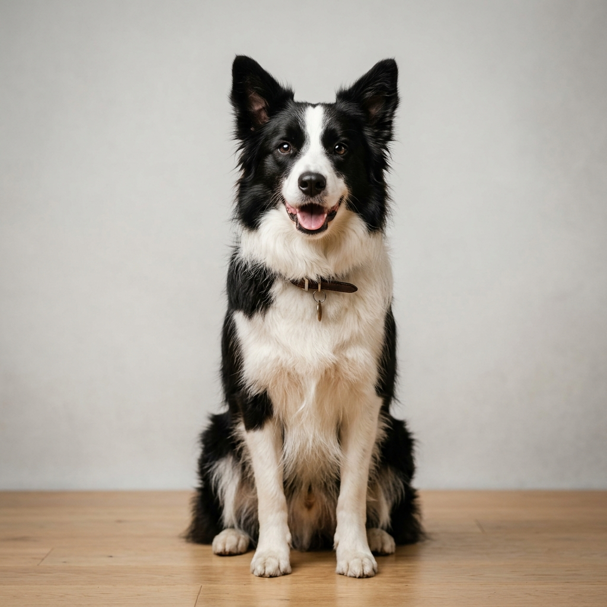

# 🐾 Happy Paws Training Center

> Trang web và Chrome Extension tiện ích mở rộng cho trung tâm huấn luyện chó chuyên nghiệp **Happy Paws**.



---

## 📋 Giới thiệu

**Happy Paws Training Center** là nền tảng web hiện đại được xây dựng cho trung tâm huấn luyện cún cưng chuyên nghiệp, cung cấp:

- 🐶 Thông tin đầy đủ về các khóa đào tạo chó (Puppy, Group, Private, Board & Train)
- 📅 Lịch học chi tiết với giao diện bảng phấn (Chalkboard) độc đáo
- ⭐ Đánh giá & câu chuyện của khách hàng thực tế
- 📰 Blog kiến thức chăm sóc thú cưng
- 📱 Hỗ trợ đầy đủ thiết bị di động (Responsive)

---

## ✨ Tính năng nổi bật

| Tính năng | Mô tả |
|---|---|
| 🎨 Thiết kế Luxury Dark/Light | Giao diện sang trọng, hiện đại chuẩn 2026 |
| 🔍 Tìm kiếm toàn trang | Overlay tìm kiếm tức thì |
| 📱 Mobile Navigation | Menu drawer di động mượt mà |
| 🖼️ Blog Carousel | Slider bài viết có hỗ trợ cảm ứng vuốt |
| ⚡ Chrome Extension | Hoạt động như một tiện ích mở rộng popup |
| 🧲 Scroll Animations | Hiệu ứng cuộn mượt mà bằng Intersection Observer |

---

## 🚀 Cài đặt & Sử dụng

### Chạy trực tiếp dưới dạng Website

```bash
# Clone repository
git clone https://github.com/QuangDuyKhanh/Desweb.git

# Mở trực tiếp bằng trình duyệt
# Mở tệp index.html trong thư mục vừa clone
```

### Cài đặt như Chrome Extension

1. Mở Google Chrome và truy cập `chrome://extensions/`
2. Bật **Developer mode** (Chế độ nhà phát triển) ở góc trên bên phải
3. Nhấp **Load unpacked** → Chọn thư mục dự án `Desweb`
4. Nhấp vào icon 🐾 trên thanh công cụ để mở popup trên bất kỳ trang web nào!

---

## 🗂️ Cấu trúc dự án

```
Desweb/
├── index.html          # Trang HTML chính
├── style.css           # Toàn bộ styles & thiết kế
├── script.js           # Bộ điều khiển tương tác JS
├── manifest.json       # Cấu hình Chrome Extension (Manifest V3)
├── .gitignore          # Loại trừ tệp nhạy cảm
└── assets/
    └── images/
        ├── hero-dog.png    # Ảnh chính banner Hero
        └── logo.png        # Logo Chrome Extension
```

---

## 🛠️ Công nghệ sử dụng

- **HTML5** – Cấu trúc ngữ nghĩa
- **Vanilla CSS** – Thiết kế, animation hoàn toàn thuần
- **Vanilla JavaScript (ES6+)** – Tương tác không phụ thuộc thư viện nặng
- **Font Awesome 6** – Bộ icon toàn diện
- **Google Fonts** – Outfit, Plus Jakarta Sans, Fredoka

---

## 📸 Giao diện

> Trang web tích hợp giao diện Glassmorphism, Dark Mode chalkboard, floating badges và nhiều hiệu ứng micro-animation đẹp mắt.

---

## 📄 Giấy phép

© 2026 Happy Paws Training Center. Bảo lưu mọi quyền.

---

## 👤 Tác giả

**Quang Duy Khanh**
- GitHub: [@QuangDuyKhanh](https://github.com/QuangDuyKhanh)
